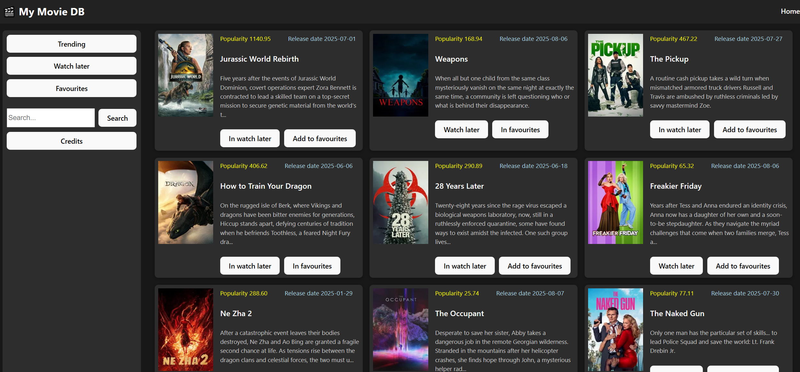

# Movie Explorer

A React app built with Vite that lets you search movies, browse trending titles, and manage your watch later and favorites lists.

## Features

- Search movies by title
- View trending movies
- Add/remove movies to/from **Watch Later** list
- Add/remove movies to/from **Favorites** list

## Screenshot


## Installation

```
npm install
npm run dev
```

## Environment Variables

Make sure to add your TMDb API access token in the existing `.env` file:
```
VITE_ACCESS_TOKEN=your_tmdb_access_token_here
```
## Attribution
This product uses the TMDb API but is not endorsed or certified by TMDb.


